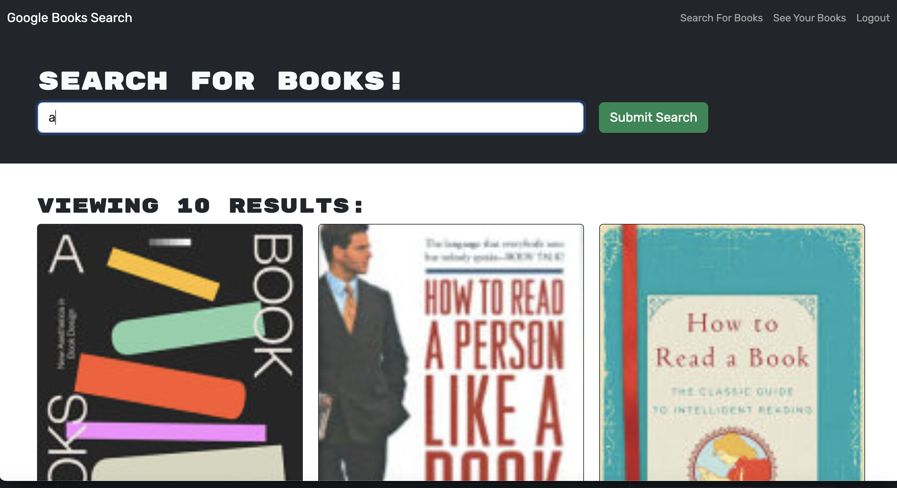
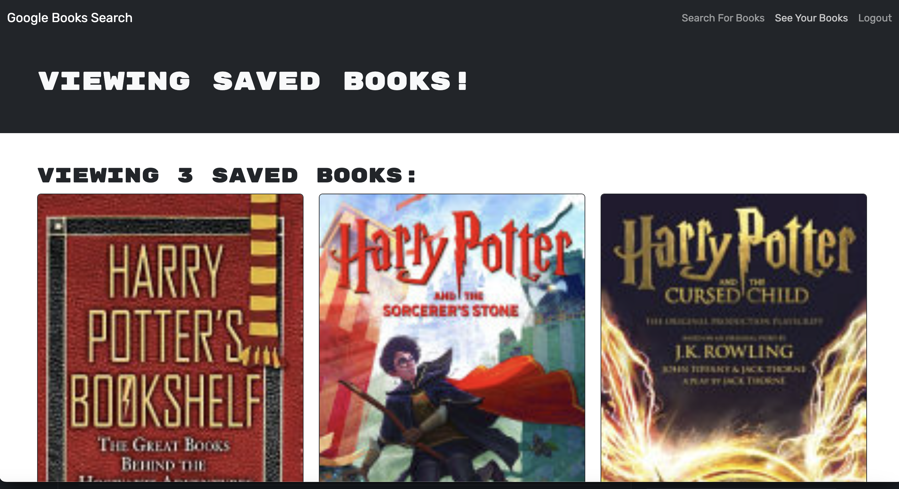

# MERN Book Search Engine with GraphQL Refactor

## Table of Contents

1. [Overview](#overview)
2. [Demo](#demo)
3. [Concepts Covered](#concepts-covered)
4. [Learning Objectives](#learning-objectives)
5. [Technologies Used](#technologies-used)
6. [Features](#features)
7. [Setup and Installation](#setup-and-installation)
   - [Prerequisites](#prerequisites)
   - [Steps to Run Locally](#steps-to-run-locally)
   - [Deploying to Render](#deploying-to-render)
8. [Summary](#summary)

## Overview

The **MERN Book Search Engine** is a refactored application that allows users to search for books using the Google Books API and save books they are interested in. Originally built with a RESTful API, the application has been refactored to use **GraphQL** powered by Apollo Server for improved performance and scalability. The app is built with the **MERN stack**: MongoDB, Express.js, React, and Node.js.

Users can search for books, create accounts, log in, save books to their profile, and remove saved books. The application uses **MongoDB Atlas** for data storage and is deployed on **Render**, ensuring seamless integration and accessibility.

## Demo





[Live Demo](https://mern-book-search-engine-kisn.onrender.com)

## Concepts Covered

- **GraphQL Integration**:

  - Replaced RESTful API with a GraphQL API for improved data fetching and management.
  - Implemented queries and mutations to handle user authentication and book operations.

- **Apollo Client and Server**:

  - Used Apollo Server for managing GraphQL schemas, resolvers, and middleware.
  - Integrated Apollo Client into the React frontend for executing GraphQL queries and mutations.

- **Authentication Middleware**:

  - Refactored authentication middleware to work seamlessly with GraphQL context.

- **Google Books API Integration**:

  - Used the Google Books API to fetch book data dynamically based on user search inputs.

- **Deployment**:
  - Deployed the application to Render with a MongoDB Atlas database.

## Learning Objectives

- Learn how to refactor a RESTful API to GraphQL using Apollo Server.
- Understand how to implement user authentication and authorization with JWT in a GraphQL context.
- Learn how to manage state and data with Apollo Client in a React application.
- Understand the MERN stack and its practical application in building full-stack web applications.
- Deploy a full-stack application to a cloud platform like Render with database integration.

## Technologies Used

- **MongoDB**: NoSQL database for storing user and book data.
- **Express.js**: Web framework for building the server and managing routes.
- **React**: Frontend library for building the user interface.
- **Node.js**: JavaScript runtime for server-side logic.
- **GraphQL**: API query language for efficient data retrieval and mutation.
- **Apollo Server**: GraphQL server for managing schema and resolvers.
- **Apollo Client**: Client-side library for executing GraphQL queries and mutations.
- **JWT**: JSON Web Token for user authentication and session management.
- **Render**: Cloud platform for deploying the application.
- **Google Books API**: External API for fetching book details.

## Features

- **GraphQL Integration**: Efficiently fetch and mutate data using queries and mutations.
- **Search Functionality**: Search books using the Google Books API and view detailed results.
- **User Authentication**: Securely create accounts, log in, and manage user sessions.
- **Save Books**: Save books to a personalized list for future reference.
- **Remove Books**: Remove books from the saved list.
- **Responsive Design**: Mobile-friendly design for seamless access on all devices.

## Setup and Installation

### Prerequisites

- Node.js (v14 or later)
- MongoDB Atlas account
- npm (Node package manager)

### Steps to Run Locally

1. Install server dependencies:

   ```bash
   cd server
   npm install
   ```

2. Install client dependencies:

   ```bash
   cd ../client
   npm install
   ```

3. Set up a `.env` file in the `server` directory:

   ```plaintext
   MONGODB_URI=your_mongodb_atlas_uri
   JWT_SECRET=your_jwt_secret
   PORT=3001
   ```

4. Run the application locally:

   ```bash
   npm run develop
   ```

5. Open your browser and navigate to `http://localhost:3000`.

### Deploying to Render

1. Create a new MongoDB cluster on **MongoDB Atlas** and get the connection URI.
2. Sign up on [Render](https://render.com) and create a new web service for the server.
3. Add the environment variables (`MONGODB_URI`, `JWT_SECRET`, and `PORT`) in the Render dashboard.
4. Deploy the server by connecting your GitHub repository to Render.
5. Deploy the React client similarly by setting the build command to `npm run build` and the start command to `serve -s build`.

## Summary

This application provides a seamless experience for users to search for books, save their favorite books, and manage their personal book list. The refactor from RESTful to GraphQL APIs demonstrates the benefits of flexible and efficient data handling, while the integration of MongoDB ensures scalability.

The use of **Apollo Server** and **Apollo Client** makes the application modular and easier to maintain, while deployment to Render ensures that the app is available online with secure database connections.
